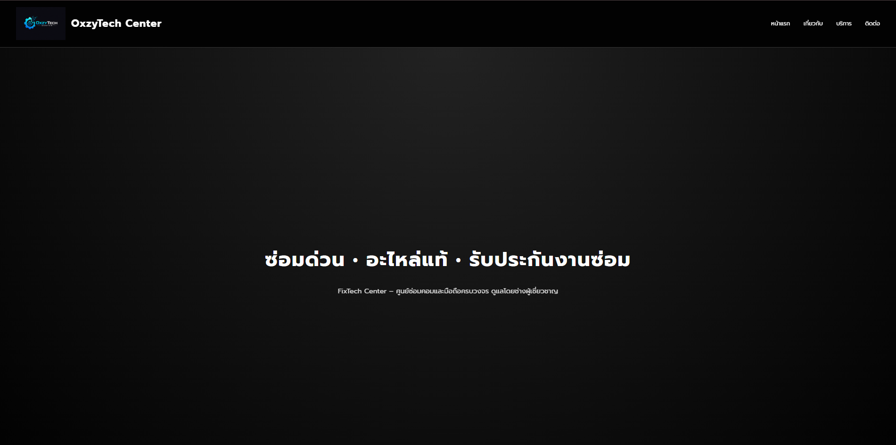

# FixTech Center – เว็บไซต์ศูนย์ซ่อมคอม–มือถือ และระบบความปลอดภัยไซเบอร์

เว็บไซต์นี้เป็นโปรเจกต์ตัวอย่างสำหรับบริษัท FixTech Center  
ซึ่งให้บริการด้าน **Cyber Security**, **การซ่อมคอม–มือถือ**, และ **บริการ IT Support ครบวงจร**  
ภายในเว็บไซต์ประกอบด้วยเนื้อหาครบถ้วนตามหัวข้อ เช่น วิสัยทัศน์ บริการ ราคา ทีมงาน และช่องทางการติดต่อ

---

## 🌟 วิสัยทัศน์ (Vision)

**“มุ่งสู่การเป็นผู้นำด้าน Cyber Security ที่ขับเคลื่อนด้วยเทคโนโลยี AI  
เพื่อปกป้องข้อมูลและระบบของลูกค้าอย่างชาญฉลาดและยั่งยืน”**

ทีม FixTech มุ่งมั่นในการผสานเทคโนโลยี AI, ระบบป้องกันภัยไซเบอร์ และการสนับสนุนด้าน IT  
เพื่อยกระดับความปลอดภัยและความเสถียรภาพในการใช้งานเทคโนโลยีของลูกค้า

---

## 🛠️ บริการของเรา (Services)

เว็บไซต์แสดงบริการหลัก 3 ประเภท:

### 1. 🔐 **Penetration Testing (ทดสอบเจาะระบบ)**  
จำลองการโจมตีไซเบอร์แบบมืออาชีพเพื่อตรวจหาช่องโหว่ก่อนแฮกเกอร์ตัวจริง

### 2. 🚨 **Disaster Recovery (กู้คืนระบบฉุกเฉิน)**  
รองรับเหตุการณ์โจมตีหรือระบบล่ม  
สามารถกู้คืนข้อมูลสำคัญได้ภายใน 1 ชั่วโมง

### 3. 🖥️ **24/7 IT Security Monitoring**  
บริการเฝ้าระวังภัยตลอด 24 ชั่วโมง  
ตรวจจับความผิดปกติทันทีด้วยระบบ AI

---

## 💰 โครงสร้างราคา (Pricing Plans)

ภายในเว็บไซต์มีตารางเปรียบเทียบราคา 3 แพ็กเกจ ได้แก่:

| แพ็กเกจ | 24/7 Monitoring | Disaster Recovery | PenTest | ราคา |
|---------|------------------|-------------------|---------|-------|
| Basic | ✔ | ✘ | ✘ | 1,500 บาท/เดือน |
| Standard | ✔ | ✔ | ✘ | 3,259 บาท/เดือน |
| Premium | ✔ | ✔ | ✔ | 5,599 บาท/เดือน |

---

## 👨‍💼 ทีมผู้บริหาร (Executive Team)

เว็บไซต์แสดงทีมผู้บริหารด้วยโครงสร้าง `<figure>` เช่น

- CEO ระดับโลกด้าน Cyber Security  
- CTO ผู้เชี่ยวชาญด้าน AI และ Machine Learning  
- Head of Recovery ผู้มีประสบการณ์กู้ระบบระดับองค์กร  
- ทีม Security Analyst ที่ผ่านการรับรองสากล เช่น CEH, OSCP  

---

<figcaption>หน้าแรก</figcaption>
